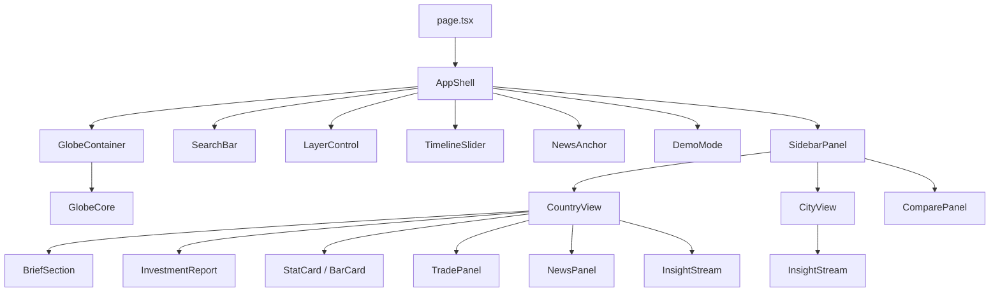
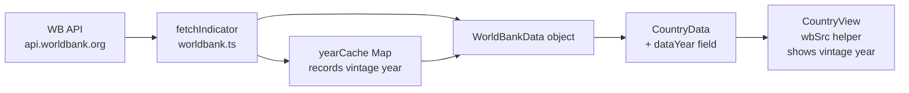
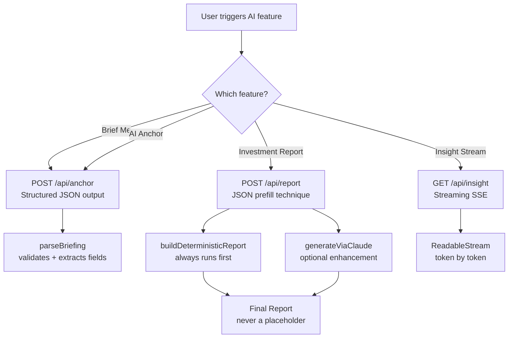
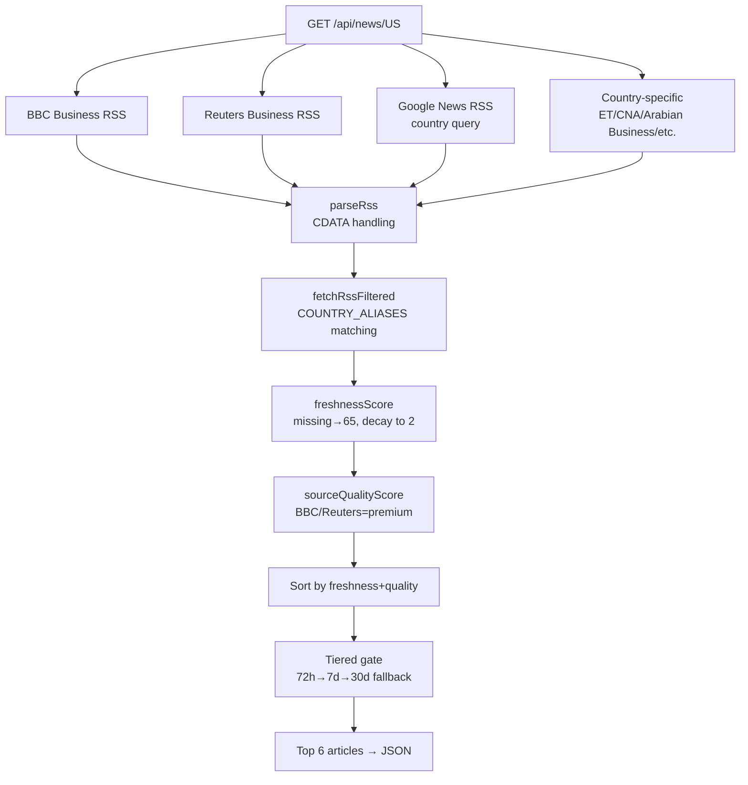
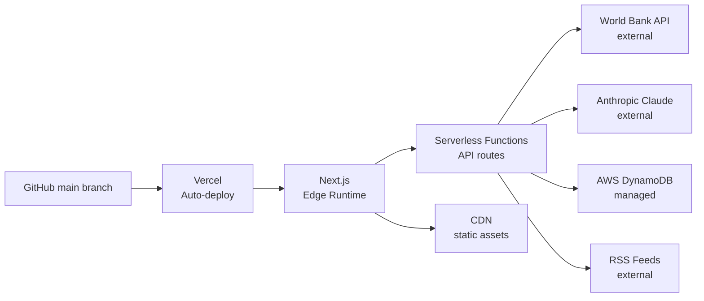

# Architecture

PulseEarth is a full-stack Next.js application with a React/Three.js frontend, serverless API layer, AWS DynamoDB for city data, World Bank/RSS external data, and Claude Haiku for all AI features.

---

## System Overview

```
┌─────────────────────────────────────────────────────────────────────────┐
│                          User's Browser                                 │
│                                                                         │
│  ┌─────────────────────────────────────────────────────────────────┐   │
│  │ AppShell (React client state manager)                            │   │
│  │                                                                  │   │
│  │  ┌───────────────┐  ┌──────────────┐  ┌─────────────────────┐  │   │
│  │  │  GlobeCore    │  │  SearchBar   │  │   LayerControl      │  │   │
│  │  │  (Three.js +  │  │  (debounced) │  │   (6 toggles)       │  │   │
│  │  │  react-globe) │  └──────────────┘  └─────────────────────┘  │   │
│  │  └───────────────┘                                              │   │
│  │                     ┌──────────────┐  ┌─────────────────────┐  │   │
│  │  ┌───────────────┐  │  DemoMode   │  │   NewsAnchor        │  │   │
│  │  │  SidebarPanel │  │  (overlay)  │  │   (AI Anchor)       │  │   │
│  │  │  CountryView  │  └──────────────┘  └─────────────────────┘  │   │
│  │  │  CityView     │                                              │   │
│  │  │  ComparePanel │  ┌──────────────────────────────────────┐   │   │
│  │  └───────────────┘  │  TimelineSlider (2015–2025)          │   │   │
│  │                     └──────────────────────────────────────┘   │   │
│  └─────────────────────────────────────────────────────────────────┘   │
└─────────────────────────────────────────────────────────────────────────┘
                                    │
                          Next.js API Routes
                    (Vercel serverless functions)
                                    │
           ┌────────────────────────┼─────────────────────────┐
           │                        │                          │
    ┌──────▼──────┐        ┌───────▼──────┐         ┌────────▼────────┐
    │  World Bank │        │ Anthropic AI  │         │  AWS DynamoDB   │
    │  Public API │        │ Claude Haiku  │         │  city-metrics   │
    │  (free, no  │        │  (AI briefing │         │  table          │
    │   auth)     │        │   + reports)  │         │  (29 cities)    │
    └─────────────┘        └──────────────┘         └─────────────────┘
           │
    ┌──────▼──────┐
    │  RSS Feeds  │
    │  BBC/Reuters│
    │  Google News│
    │  Country-   │
    │  specific   │
    └─────────────┘
```

---

## Frontend Architecture

### Component Hierarchy



### State Management

All state lives in `AppShell` — no external state library (Redux, Zustand, etc.) is used.

```typescript
// Core state in AppShell
const [selectedEntity, setSelectedEntity] = useState<SelectedEntity | null>(null)
const [compareEntity, setCompareEntity]   = useState<SelectedEntity | null>(null)
const [isComparing, setIsComparing]       = useState(false)
const [layers, setLayers]                 = useState<LayerState>(DEFAULT_LAYERS)
const [flyTo, setFlyTo]                   = useState<FlyTo | null>(null)
const [timelineYear, setTimelineYear]     = useState(2025)
const [demoActive, setDemoActive]         = useState(false)
const [isLoaded, setIsLoaded]             = useState(false)
```

State flows downward via props. Events flow upward via callbacks. No context API is used — all data sharing is explicit through prop drilling or direct API calls from leaf components.

### Globe Rendering Pipeline

```mermaid
graph LR
    A[NaturalEarth GeoJSON<br/>CDN fetch] --> B[GlobeCore mount]
    C[/api/cities DynamoDB] --> B
    D[/api/heatmap WB API] --> B
    B --> E[Three.js Scene Setup<br/>ACESFilmic, tone mapping<br/>ambient + directional lights]
    E --> F[react-globe.gl render]
    F --> G[Country polygons<br/>hover/select states]
    F --> H[City dots + rings]
    F --> I[Trade route arcs<br/>golden animated dashes]
    F --> J[City network arcs<br/>solid cyan]
    F --> K[HTML glow disc<br/>selection indicator]
```

**Rendering decisions:**
- Globe is dynamically imported (`next/dynamic`, `ssr: false`) to prevent Three.js SSR errors
- Three.js renderer is configured via `globeRef.current.renderer()` in a one-time `useEffect`
- Country polygon colors are computed via memoized callbacks to avoid re-renders
- All click handlers use `useCallback` with stable references via `useRef`
- Auto-rotation pauses on `OrbitControls` `start` event, resumes 4s after `end`

---

## Backend Architecture

### API Route Design

All routes follow the same pattern:
1. Parse and validate input
2. Fetch external data with timeout + error handling
3. Compute derived values
4. Return JSON

```typescript
// Standard route pattern
export async function GET(req: Request, { params }: { params: Promise<{ code: string }> }) {
  const { code } = await params           // Next.js 16: params is a Promise
  try {
    const data = await fetch(url, { signal: AbortSignal.timeout(7000) })
    // ...
    return NextResponse.json({ success: true, ... })
  } catch (err) {
    return NextResponse.json({ success: false, error: String(err) }, { status: 500 })
  }
}
```

### Data Fetching Patterns

**Parallel with `Promise.allSettled`** (country route):
```typescript
const [cities, wb, rc] = await Promise.allSettled([
  getCitiesByCountryCode(code),   // DynamoDB
  getWorldBankData(code, year),   // World Bank API
  getRestCountryData(code),       // WB country metadata
])
// Each has a fallback — no single failure blocks the response
```

**Streaming with ReadableStream** (insight route):
```typescript
const body = new ReadableStream({
  async start(controller) {
    const stream = await client.messages.stream({ ... })
    for await (const chunk of stream) {
      controller.enqueue(encoder.encode(chunk.delta?.text ?? ''))
    }
    controller.close()
  }
})
return new Response(body, { headers: { 'Content-Type': 'text/event-stream' } })
```

---

## Data Architecture

### World Bank Data Flow



**World Bank indicators fetched per country:**

| Field | Indicator | Notes |
|---|---|---|
| population_m | SP.POP.TOTL | Divided by 1,000,000 |
| gdp_billion | NY.GDP.MKTP.CD | Divided by 1,000,000,000 |
| gdpGrowth | NY.GDP.MKTP.KD.ZG | Percentage, constant prices |
| gdpPerCapita | NY.GDP.PCAP.CD | Current USD |
| inflation | FP.CPI.TOTL.ZG | CPI annual percentage |
| unemployment | SL.UEM.TOTL.ZS | % of labor force |
| lifeExpectancy | SP.DYN.LE00.IN | Years |
| dataYear | derived | Year of most recent GDP data |

### DynamoDB Schema

**Table name:** `city-metrics` (configurable via `DYNAMODB_TABLE_NAME`)

**Partition key:** `cityId` (String) — generated as `{countryCode}_{cityName_lowercase_underscored}`

**Item structure:**
```json
{
  "cityId": "SG_singapore",
  "name": "Singapore",
  "country": "Singapore",
  "countryCode": "SG",
  "lat": 1.3521,
  "lng": 103.8198,
  "gdp_billion": 466,
  "population_m": 5.9,
  "startup_count": 4200,
  "trade_volume_b": 880,
  "risk_score": 8,
  "pulse_intensity": 0.92
}
```

**Access patterns:**
- `getAllCityDots()` → full table scan (29 items, fast)
- `getCitiesByCountryCode(code)` → scan with filter expression on `countryCode`
- `getCityById(cityId)` → `GetItem` by partition key

### Scoring Algorithms

**Risk Score (0–100, lower = safer):**
```
base = 30
+ inflation > 20 → +30, > 10 → +20, > 5 → +10, < 0 → +5
+ unemployment > 20 → +20, > 10 → +12, > 5 → +6
+ gdpGrowth < -2 → +15, < 0 → +8, > 5 → -5, > 3 → -3
+ gdpPerCapita < 1000 → +15, < 5000 → +8, > 30000 → -8, > 15000 → -4
= clamp(0, 100)
```

**Innovation Index (10–98):**
```
base = 40
+ gdpPerCapita > 50000 → +30, > 25000 → +22, > 10000 → +14, > 3000 → +6
+ lifeExpectancy > 80 → +15, > 72 → +8, > 65 → +3
+ (100 - riskScore) × 0.15
= clamp(10, 98)
```

**Investment Recommendation:**
```
growthPts  = clamp(gdpGrowth × 5, -15, 35)
riskPts    = max(0, 35 - risk × 0.35)
inflPts    = inflation < 2.5 → 18, < 5 → 15, < 8 → 10, < 15 → 4, else 0
innovPts   = min(innovation × 0.1, 10)
total      = growthPts + riskPts + inflPts + innovPts
≥72 → STRONG BUY | ≥58 → BUY | ≥40 → HOLD | ≥22 → UNDERWEIGHT | else AVOID
```

**Heatmap (log-normalized percentile):**
```
logVal = log(gdpPerCapita + 1)
score  = (logVal - minLog) / (maxLog - minLog)  → 0 to 1
percentile = rank(score) / (n - 1)              → 0 to 1
color tier: ≥0.90 cyan-green | ≥0.75 green | ≥0.40 gold | ≥0.25 orange-red | else crimson
```

---

## AI Architecture

### Claude Haiku Integration

All AI features use `claude-haiku-4-5-20251001` via `@anthropic-ai/sdk`.



**JSON Prefill Pattern** (investment report only):
```typescript
messages: [
  { role: 'user', content: prompt },
  { role: 'assistant', content: '{' },   // Forces model to complete a JSON object
],
// Response prefix: '{' + block.text
```

This technique eliminates the most common Claude JSON failure mode (preamble text before the JSON object).

### News Pipeline Architecture



---

## Deployment Architecture



**Vercel configuration:**
- Framework: Next.js (auto-detected)
- Build command: `npm run build`
- Output: `.next/`
- Environment variables: set in Vercel dashboard (not in repo)
- Region: recommended `iad1` (US East) for low-latency DynamoDB access if using `us-east-1`

---

## Performance Considerations

- **Globe initialization:** Country GeoJSON is ~1.2MB. Fetched once from CloudFront CDN on mount.
- **City dots:** 29 items from DynamoDB scan. Cached in component state after first load.
- **Heatmap scores:** 24-hour edge cache at `/api/heatmap`. One WB bulk call per day.
- **Country data:** No server-side cache (user-triggered, includes year). WB API typically responds in 200–800ms.
- **AI calls:** Claude Haiku averages 1.5–3s for structured JSON responses. Streaming insight begins token-by-token within ~500ms.
- **Globe re-renders:** All polygon color callbacks are memoized with `useCallback` + `useMemo`. Selection changes trigger minimal re-renders.
