# PulseEarth — Enterprise Architecture Package

> **For:** AWS Startup Showcase · Technical Due Diligence · Investor Decks · Enterprise Documentation · Hackathon Submissions · GitHub README  
> **Generated from:** Actual codebase analysis — no assumptions, no invented features  
> **Stack:** Next.js 16 · React 19 · TypeScript 5 · Three.js r184 · AWS DynamoDB · Claude Haiku · Vercel

---

## Table of Contents

1. [System Overview](#1-system-overview)
2. [Mermaid Architecture Diagram](#2-mermaid-architecture-diagram)
3. [Draw.io Architecture Layout](#3-drawio-architecture-layout)
4. [Component Inventory](#4-component-inventory)
5. [Data Flow Diagrams](#5-data-flow-diagrams)
6. [AWS Service Mapping](#6-aws-service-mapping)
7. [AI Architecture](#7-ai-architecture)
8. [Security Architecture](#8-security-architecture)
9. [Scalability Blueprint](#9-scalability-blueprint)

---

## 1. System Overview

PulseEarth is a real-time global economic intelligence platform. It renders a 3D WebGL globe backed by live World Bank data, Google News RSS, and AI-generated analysis powered by Claude Haiku. Users navigate 173 countries and 29 city economic hubs, triggering live API calls that compose macroeconomic dashboards, investment-grade reports, AI-scripted news briefings, and audio-narrated market intelligence.

**Architecture style:** Serverless-first, edge-deployed, stateless API tier, single stateful layer (DynamoDB).

```
Request latency targets:
  Search:          < 50ms   (static lookup — no network)
  Country data:    < 2s     (parallel World Bank API calls)
  News:            < 6s     (parallel RSS + freshness scoring)
  AI Anchor:       < 15s    (LLM + optional TTS audio)
  Investment Rpt:  < 22s    (LLM with deterministic fallback)
  Heatmap scores:  < 12s    (400-country bulk WB fetch, 24h cache)
```

---

## 2. Mermaid Architecture Diagram

> Paste this block directly into any Mermaid renderer (GitHub, Mermaid Live, Notion, GitLab).

```mermaid
flowchart TB
    %% ─── USER LAYER ──────────────────────────────────────────────────────────
    subgraph USER["👤  User Layer"]
        U1["Browser / Desktop\n(React 19 + Three.js r184)"]
    end

    %% ─── FRONTEND LAYER ──────────────────────────────────────────────────────
    subgraph FRONTEND["🖥️  Next.js 16 Frontend  ·  Vercel Edge"]
        direction TB

        subgraph GLOBE["3D Globe Engine"]
            G1["GlobeCore.tsx\nreact-globe.gl + Three.js r184\nACESFilmic tone mapping"]
            G2["GlobeContainer.tsx\nSSR-disabled · dynamic import"]
        end

        subgraph UI_LAYER["UI Controls"]
            UI1["SearchBar.tsx\n280ms debounce · instant results"]
            UI2["LayerControl.tsx\n6 intelligence overlays"]
            UI3["TimelineSlider.tsx\n2015 – 2025 historical"]
            UI4["NewsAnchor.tsx\nFloating AI anchor widget + audio"]
            UI5["DemoMode.tsx\nAuto-cycle investor presentation"]
            UI6["LoadingScreen.tsx"]
        end

        subgraph SIDEBAR["Country / City Intelligence Sidebar"]
            S1["CountryView.tsx\nMacro dashboard + Brief Me"]
            S2["CityView.tsx\nCity economic profile"]
            S3["ComparePanel.tsx\nSide-by-side country comparison"]
            S4["NewsPanel.tsx\nFreshness-scored news feed"]
            S5["InsightStream.tsx\nStreaming AI intelligence brief"]
            S6["InvestmentReport.tsx\nPDF-export investment report"]
        end

        subgraph STATE["App State — AppShell.tsx"]
            ST1["selectedEntity\ncompareEntity\nlayers: LayerState\ntimelineYear\ndemoActive"]
        end
    end

    %% ─── API TIER ────────────────────────────────────────────────────────────
    subgraph API["⚡  Next.js API Routes  ·  Serverless Functions  ·  force-dynamic"]
        direction TB
        A1["GET /api/search\nStatic 173-country list + DynamoDB cities\n< 50ms · no WB call"]
        A2["GET /api/country/[code]\nWorld Bank × 7 indicators\n+ risk_score + innovationScore"]
        A3["GET /api/news/[code]\nGoogle News when:3d · BBC · Reuters\n60+ country feeds · freshness scoring"]
        A4["POST /api/anchor/[code]\nGemini → Claude Haiku\n+ Kokoro TTS audio"]
        A5["POST /api/report/[code]\nGemini → Claude Haiku\n+ deterministic fallback"]
        A6["GET /api/insight/[id]\nClaude Haiku streaming SSE\n4 modes: brief/anchor/news/investment"]
        A7["GET /api/heatmap\nBulk 400-country GDP/capita\nlog-normalized 0–1 · 24h cache"]
        A8["GET /api/trade/[code]\nWorld Bank exports/imports\n+ static bilateral partners"]
        A9["GET /api/city/[cityId]\nDynamoDB single-item query"]
        A10["GET /api/cities\nDynamoDB full scan · 29 cities"]
    end

    %% ─── DATA LAYER ──────────────────────────────────────────────────────────
    subgraph DATA["💾  Data Layer"]
        direction LR

        subgraph STATIC["Static / Compile-Time"]
            D1["countries-list.ts\n173 countries · ISO2/name/capital\nlat/lng/region · no API call"]
            D2["seed-cities.json\n29 global economic hubs\ninitial DynamoDB seed data"]
        end

        subgraph DYNAMO["AWS DynamoDB  ·  us-east-1"]
            D3["Table: city-metrics\nPK: cityId (String)\nAttributes: name · country · countryCode\nlat · lng · gdp_billion · population_m\nstartup_count · trade_volume_b\nrisk_score · pulse_intensity\nai_insight · insight_updated"]
        end

        subgraph COMPUTE["Computed Scores  ·  Server-side"]
            D4["risk_score 0–100\nf(inflation, unemployment,\ngdpGrowth, gdpPerCapita)"]
            D5["innovationScore 0–100\nf(gdpPerCapita, lifeExpectancy, risk)"]
            D6["overallRecommendation\nSTRONG BUY / BUY / HOLD\nUNDERWEIGHT / AVOID\ncomposite of growth+risk+inflation+innovation"]
        end
    end

    %% ─── EXTERNAL DATA SOURCES ───────────────────────────────────────────────
    subgraph EXTERNAL["🌐  External Data Sources  ·  All Free · No Auth Required (except HF)"]
        direction TB
        E1["World Bank API\napi.worldbank.org/v2\n7 indicators · 173 countries\n24h in-memory cache"]
        E2["Google News RSS\nnews.google.com/rss\nwhen:3d freshness filter\nper-country economic queries"]
        E3["BBC Business RSS\nfeeds.bbci.co.uk\nCountry-name filtered"]
        E4["Reuters Business RSS\nfeeds.reuters.com\nCountry-name filtered"]
        E5["Country-Specific Feeds\n17 outlets: Economic Times · BusinessDay\nJapan Times · Bangkok Post · Dawn · etc"]
        E6["NaturalEarth GeoJSON\nCloudFront CDN\n250-country polygon data"]
        E7["Globe Textures\njsDelivr CDN\nWebGL earth texture maps"]
    end

    %% ─── AI LAYER ────────────────────────────────────────────────────────────
    subgraph AI["🤖  AI Layer"]
        direction TB
        AI1["Claude Haiku\nclaude-haiku-4-5-20251001\nPrimary: all AI features\nStreaming SSE for InsightStream"]
        AI2["Gemini 1.5 Flash\ngenerationConfig JSON mode\nOptional: tried first for\nAnchor + Investment Report"]
        AI3["Kokoro-82M TTS\nHuggingFace Inference API\nAI Anchor audio generation"]
        AI4["Parler TTS Mini v1\nHuggingFace Inference API\nTTS fallback · female voice"]
        AI5["Deterministic Engine\nbuildDeterministicReport()\nAlways runs · zero AI dependency\nGuaranteed non-empty output"]
    end

    %% ─── DEPLOYMENT ──────────────────────────────────────────────────────────
    subgraph DEPLOY["🚀  Deployment  ·  CI/CD"]
        direction LR
        DEP1["GitHub Repository\nMain branch"]
        DEP2["Vercel\nAuto-deploy on push\nEdge Functions\nGlobal CDN"]
        DEP3["Environment Variables\nANTHROPIC_API_KEY\nAWS_ACCESS_KEY_ID\nAWS_SECRET_ACCESS_KEY\nAWS_REGION\nDYNAMODB_TABLE_NAME\nGEMINI_API_KEY (opt)\nHUGGING_FACE_TOKEN (opt)\nCRON_SECRET (opt)"]
    end

    %% ─── CONNECTIONS ─────────────────────────────────────────────────────────
    U1 <-->|"HTTPS · WebSocket"| FRONTEND
    FRONTEND <-->|"fetch() · SSE streaming"| API

    %% Globe internal
    G2 --> G1
    STATE --> G2
    STATE --> SIDEBAR
    STATE --> UI_LAYER

    %% API → Data
    A1 --> D1
    A1 --> D3
    A2 --> E1
    A2 --> D3
    A2 --> D4
    A2 --> D5
    A3 --> E2
    A3 --> E3
    A3 --> E4
    A3 --> E5
    A4 --> AI2
    A4 --> AI1
    A4 --> AI3
    A4 --> AI4
    A5 --> AI2
    A5 --> AI1
    A5 --> AI5
    A6 --> AI1
    A7 --> E1
    A8 --> E1
    A9 --> D3
    A10 --> D3

    %% Sidebar wires
    S1 --> A2
    S1 --> A4
    S4 --> A3
    S5 --> A6
    S6 --> A5
    S6 --> A8
    S3 --> A2

    %% Globe layers fetch
    G1 -->|"heatmap layer"| A7
    G1 -->|"city layer"| A10
    G1 -->|"trade routes"| E6

    %% Deployment
    DEP1 -->|"git push"| DEP2
    DEP2 -->|"env inject"| DEP3
    DEP2 --> FRONTEND
    DEP2 --> API

    %% Styling
    classDef aws fill:#FF9900,color:#000,stroke:#232F3E,stroke-width:2px
    classDef ai fill:#6B46C1,color:#fff,stroke:#553C9A,stroke-width:2px
    classDef vercel fill:#000,color:#fff,stroke:#fff,stroke-width:1px
    classDef data fill:#0ea5e9,color:#fff,stroke:#0284c7,stroke-width:2px
    classDef extern fill:#059669,color:#fff,stroke:#047857,stroke-width:2px

    class D3 aws
    class AI1,AI2,AI3,AI4,AI5 ai
    class DEP2 vercel
    class D1,D2,D4,D5,D6 data
    class E1,E2,E3,E4,E5,E6,E7 extern
```



---

## 3. Draw.io Architecture Layout

### Instructions
1. Open Draw.io (draw.io or diagrams.net)
2. Create a new blank diagram
3. Use "Extras → Edit Diagram" and paste the XML below  
   **OR** recreate manually using the spec below

### XML Import (Paste into "Extras → Edit Diagram")

```xml
<mxGraphModel dx="1422" dy="762" grid="1" gridSize="10" guides="1" tooltips="1" connect="1" arrows="1" fold="1" page="1" pageScale="1" pageWidth="1654" pageHeight="1169" math="0" shadow="0">
  <root>
    <mxCell id="0" />
    <mxCell id="1" parent="0" />

    <!-- ═══ SWIM LANE: USER ═══ -->
    <mxCell id="10" value="👤 User" style="swimlane;fillColor=#dae8fc;strokeColor=#6c8ebf;fontSize=13;fontStyle=1;startSize=30;" vertex="1" parent="1">
      <mxGeometry x="40" y="40" width="1560" height="80" as="geometry" />
    </mxCell>
    <mxCell id="11" value="Web Browser / Desktop App&#xa;(React 19 + WebGL)" style="rounded=1;fillColor=#dae8fc;strokeColor=#6c8ebf;" vertex="1" parent="10">
      <mxGeometry x="640" y="30" width="280" height="40" as="geometry" />
    </mxCell>

    <!-- ═══ SWIM LANE: FRONTEND ═══ -->
    <mxCell id="20" value="🖥️ Next.js 16 Frontend  ·  Vercel Edge CDN" style="swimlane;fillColor=#f5f5f5;strokeColor=#666;fontSize=13;fontStyle=1;startSize=30;" vertex="1" parent="1">
      <mxGeometry x="40" y="140" width="1560" height="300" as="geometry" />
    </mxCell>

    <!-- Globe Engine group -->
    <mxCell id="21" value="3D Globe Engine" style="swimlane;fillColor=#fff2cc;strokeColor=#d6b656;startSize=25;" vertex="1" parent="20">
      <mxGeometry x="20" y="40" width="340" height="230" as="geometry" />
    </mxCell>
    <mxCell id="22" value="GlobeCore.tsx&#xa;react-globe.gl + Three.js r184&#xa;ACESFilmic tone mapping&#xa;6 intelligence layers" style="rounded=1;fillColor=#fff2cc;strokeColor=#d6b656;" vertex="1" parent="21">
      <mxGeometry x="20" y="35" width="300" height="70" as="geometry" />
    </mxCell>
    <mxCell id="23" value="Globe Layers&#xa;① Heatmap (GDP/capita log-norm)&#xa;② Trade Routes (30 bilateral arcs)&#xa;③ City Network (29 hubs)&#xa;④ Investment overlay&#xa;⑤ News layer&#xa;⑥ Timeline 2015–2025" style="rounded=1;fillColor=#fff2cc;strokeColor=#d6b656;align=left;spacingLeft=8;" vertex="1" parent="21">
      <mxGeometry x="20" y="120" width="300" height="100" as="geometry" />
    </mxCell>

    <!-- UI Controls group -->
    <mxCell id="24" value="UI Controls" style="swimlane;fillColor=#f5f5f5;strokeColor=#666;startSize=25;" vertex="1" parent="20">
      <mxGeometry x="380" y="40" width="340" height="230" as="geometry" />
    </mxCell>
    <mxCell id="25" value="SearchBar.tsx&#xa;280ms debounce · instant (&lt;50ms)" style="rounded=1;" vertex="1" parent="24">
      <mxGeometry x="20" y="35" width="300" height="40" as="geometry" />
    </mxCell>
    <mxCell id="26" value="LayerControl.tsx  (6 toggleable layers)" style="rounded=1;" vertex="1" parent="24">
      <mxGeometry x="20" y="85" width="300" height="35" as="geometry" />
    </mxCell>
    <mxCell id="27" value="NewsAnchor.tsx  (AI anchor + TTS audio)" style="rounded=1;" vertex="1" parent="24">
      <mxGeometry x="20" y="130" width="300" height="35" as="geometry" />
    </mxCell>
    <mxCell id="28" value="DemoMode.tsx  (auto-cycle presentation)" style="rounded=1;" vertex="1" parent="24">
      <mxGeometry x="20" y="175" width="300" height="35" as="geometry" />
    </mxCell>

    <!-- Sidebar group -->
    <mxCell id="29" value="Country / City Intelligence Sidebar" style="swimlane;fillColor=#d5e8d4;strokeColor=#82b366;startSize=25;" vertex="1" parent="20">
      <mxGeometry x="740" y="40" width="800" height="230" as="geometry" />
    </mxCell>
    <mxCell id="30" value="CountryView.tsx&#xa;Macro dashboard + Brief Me + Compare" style="rounded=1;fillColor=#d5e8d4;strokeColor=#82b366;" vertex="1" parent="29">
      <mxGeometry x="20" y="35" width="230" height="50" as="geometry" />
    </mxCell>
    <mxCell id="31" value="NewsPanel.tsx&#xa;Freshness-scored news feed" style="rounded=1;fillColor=#d5e8d4;strokeColor=#82b366;" vertex="1" parent="29">
      <mxGeometry x="270" y="35" width="230" height="50" as="geometry" />
    </mxCell>
    <mxCell id="32" value="InvestmentReport.tsx&#xa;PDF-export investment report" style="rounded=1;fillColor=#d5e8d4;strokeColor=#82b366;" vertex="1" parent="29">
      <mxGeometry x="520" y="35" width="230" height="50" as="geometry" />
    </mxCell>
    <mxCell id="33" value="InsightStream.tsx&#xa;Streaming AI intelligence (SSE)" style="rounded=1;fillColor=#d5e8d4;strokeColor=#82b366;" vertex="1" parent="29">
      <mxGeometry x="20" y="110" width="230" height="50" as="geometry" />
    </mxCell>
    <mxCell id="34" value="ComparePanel.tsx&#xa;Side-by-side 2-country comparison" style="rounded=1;fillColor=#d5e8d4;strokeColor=#82b366;" vertex="1" parent="29">
      <mxGeometry x="270" y="110" width="230" height="50" as="geometry" />
    </mxCell>
    <mxCell id="35" value="CityView.tsx&#xa;City economic profile" style="rounded=1;fillColor=#d5e8d4;strokeColor=#82b366;" vertex="1" parent="29">
      <mxGeometry x="520" y="110" width="230" height="50" as="geometry" />
    </mxCell>

    <!-- ═══ SWIM LANE: API TIER ═══ -->
    <mxCell id="40" value="⚡ Next.js Serverless API Routes  ·  force-dynamic  ·  max 55s timeout" style="swimlane;fillColor=#ffe6cc;strokeColor=#d79b00;fontSize=13;fontStyle=1;startSize=30;" vertex="1" parent="1">
      <mxGeometry x="40" y="460" width="1560" height="220" as="geometry" />
    </mxCell>
    <mxCell id="41" value="GET /api/search&#xa;Static list + DynamoDB&#xa;&lt;50ms" style="rounded=1;fillColor=#ffe6cc;strokeColor=#d79b00;" vertex="1" parent="40">
      <mxGeometry x="20" y="40" width="160" height="70" as="geometry" />
    </mxCell>
    <mxCell id="42" value="GET /api/country/[code]&#xa;WB × 7 indicators&#xa;risk + innovation scores" style="rounded=1;fillColor=#ffe6cc;strokeColor=#d79b00;" vertex="1" parent="40">
      <mxGeometry x="200" y="40" width="160" height="70" as="geometry" />
    </mxCell>
    <mxCell id="43" value="GET /api/news/[code]&#xa;Google News when:3d&#xa;BBC · Reuters · 17 feeds" style="rounded=1;fillColor=#ffe6cc;strokeColor=#d79b00;" vertex="1" parent="40">
      <mxGeometry x="380" y="40" width="160" height="70" as="geometry" />
    </mxCell>
    <mxCell id="44" value="POST /api/anchor/[code]&#xa;AI briefing + TTS audio&#xa;Gemini→Claude→fallback" style="rounded=1;fillColor=#ffe6cc;strokeColor=#d79b00;" vertex="1" parent="40">
      <mxGeometry x="560" y="40" width="160" height="70" as="geometry" />
    </mxCell>
    <mxCell id="45" value="POST /api/report/[code]&#xa;Investment report PDF&#xa;Deterministic fallback" style="rounded=1;fillColor=#ffe6cc;strokeColor=#d79b00;" vertex="1" parent="40">
      <mxGeometry x="740" y="40" width="160" height="70" as="geometry" />
    </mxCell>
    <mxCell id="46" value="GET /api/insight/[id]&#xa;Streaming SSE&#xa;Claude Haiku · 4 modes" style="rounded=1;fillColor=#ffe6cc;strokeColor=#d79b00;" vertex="1" parent="40">
      <mxGeometry x="920" y="40" width="160" height="70" as="geometry" />
    </mxCell>
    <mxCell id="47" value="GET /api/heatmap&#xa;400-country bulk WB&#xa;Log-norm · 24h cache" style="rounded=1;fillColor=#ffe6cc;strokeColor=#d79b00;" vertex="1" parent="40">
      <mxGeometry x="1100" y="40" width="160" height="70" as="geometry" />
    </mxCell>
    <mxCell id="48b" value="GET /api/trade/[code]&#xa;Exports · Imports · Balance&#xa;Bilateral partners" style="rounded=1;fillColor=#ffe6cc;strokeColor=#d79b00;" vertex="1" parent="40">
      <mxGeometry x="1280" y="40" width="160" height="70" as="geometry" />
    </mxCell>
    <mxCell id="49b" value="GET /api/city/[id]&#xa;DynamoDB single-item&#xa;GET /api/cities scan" style="rounded=1;fillColor=#ffe6cc;strokeColor=#d79b00;" vertex="1" parent="40">
      <mxGeometry x="1380" y="120" width="160" height="70" as="geometry" />
    </mxCell>

    <!-- ═══ SWIM LANE: DATA + AI LAYER ═══ -->
    <mxCell id="50" value="💾 Data Sources  ·  🤖 AI Layer  ·  🌐 External APIs" style="swimlane;fillColor=#f5f5f5;strokeColor=#666;fontSize=13;fontStyle=1;startSize=30;" vertex="1" parent="1">
      <mxGeometry x="40" y="700" width="1560" height="300" as="geometry" />
    </mxCell>

    <!-- AWS DynamoDB -->
    <mxCell id="51" value="Amazon DynamoDB&#xa;Table: city-metrics&#xa;PK: cityId (String)&#xa;29 global economic hubs&#xa;Attributes: gdp · population&#xa;startup_count · trade_volume&#xa;risk_score · pulse_intensity&#xa;ai_insight" style="shape=mxgraph.aws4.resourceIcon;resIcon=mxgraph.aws4.dynamodb;fillColor=#FF9900;strokeColor=#232F3E;fontColor=#fff;fontStyle=1;fontSize=11;" vertex="1" parent="50">
      <mxGeometry x="20" y="40" width="220" height="240" as="geometry" />
    </mxCell>

    <!-- World Bank -->
    <mxCell id="52" value="World Bank API&#xa;api.worldbank.org/v2&#xa;Free · No auth&#xa;7 Indicators:&#xa;SP.POP.TOTL (population)&#xa;NY.GDP.MKTP.CD (GDP)&#xa;NY.GDP.MKTP.KD.ZG (growth)&#xa;NY.GDP.PCAP.CD (per capita)&#xa;FP.CPI.TOTL.ZG (inflation)&#xa;SL.UEM.TOTL.ZS (unemployment)&#xa;SP.DYN.LE00.IN (life expectancy)&#xa;24h in-memory cache" style="rounded=1;fillColor=#d5e8d4;strokeColor=#82b366;align=left;spacingLeft=8;" vertex="1" parent="50">
      <mxGeometry x="260" y="40" width="230" height="240" as="geometry" />
    </mxCell>

    <!-- News Sources -->
    <mxCell id="53" value="News RSS Sources&#xa;(All free, no auth)&#xa;&#xa;• Google News RSS&#xa;  when:3d filter&#xa;  60+ country queries&#xa;&#xa;• BBC Business RSS&#xa;  name-filtered&#xa;&#xa;• Reuters Business RSS&#xa;  name-filtered&#xa;&#xa;• 17 country-specific:&#xa;  Economic Times · BusinessDay&#xa;  Japan Times · Bangkok Post&#xa;  Dawn · Gulf News · Arabia&#xa;  Jakarta Post · CNA · etc" style="rounded=1;fillColor=#dae8fc;strokeColor=#6c8ebf;align=left;spacingLeft=8;" vertex="1" parent="50">
      <mxGeometry x="510" y="40" width="220" height="240" as="geometry" />
    </mxCell>

    <!-- Static Data -->
    <mxCell id="54" value="Static Data Layer&#xa;(Compile-time)&#xa;&#xa;countries-list.ts&#xa;173 countries&#xa;ISO2 · name · capital&#xa;lat · lng · region&#xa;&#xa;seed-cities.json&#xa;29 economic hubs&#xa;Initial DynamoDB seed&#xa;&#xa;Trade partners map&#xa;45+ bilateral configs" style="rounded=1;fillColor=#e1d5e7;strokeColor=#9673a6;align=left;spacingLeft=8;" vertex="1" parent="50">
      <mxGeometry x="750" y="40" width="210" height="240" as="geometry" />
    </mxCell>

    <!-- Claude Haiku -->
    <mxCell id="55" value="Claude Haiku&#xa;claude-haiku-4-5-20251001&#xa;Anthropic API&#xa;&#xa;① InsightStream (SSE stream)&#xa;② AI Anchor briefing&#xa;③ Investment Report&#xa;④ Brief Me executive summary&#xa;&#xa;JSON prefill technique&#xa;{ role: 'assistant', content: '{' }&#xa;guarantees valid JSON output" style="rounded=1;fillColor=#6B46C1;strokeColor=#553C9A;fontColor=#fff;align=left;spacingLeft=8;" vertex="1" parent="50">
      <mxGeometry x="980" y="40" width="230" height="240" as="geometry" />
    </mxCell>

    <!-- Gemini -->
    <mxCell id="56" value="Gemini 1.5 Flash&#xa;(Optional · GEMINI_API_KEY)&#xa;&#xa;Tried first for:&#xa;• AI Anchor script&#xa;• Investment Report&#xa;&#xa;Falls back to Claude Haiku&#xa;if key absent or call fails&#xa;&#xa;responseMimeType: json&#xa;temp: 0.60–0.72" style="rounded=1;fillColor=#4285F4;strokeColor=#1a73e8;fontColor=#fff;align=left;spacingLeft=8;" vertex="1" parent="50">
      <mxGeometry x="1230" y="40" width="200" height="240" as="geometry" />
    </mxCell>

    <!-- HuggingFace TTS -->
    <mxCell id="57" value="HuggingFace TTS&#xa;(Optional · HF_TOKEN)&#xa;&#xa;Primary: Kokoro-82M&#xa;hexgrad/Kokoro-82M&#xa;&#xa;Fallback: Parler TTS mini&#xa;parler-tts/parler-tts-mini-v1&#xa;Female anchor voice&#xa;&#xa;Returns base64 audio&#xa;for AI Anchor widget" style="rounded=1;fillColor=#FFD21E;strokeColor=#d4a017;fontColor=#000;align=left;spacingLeft=8;" vertex="1" parent="50">
      <mxGeometry x="1450" y="40" width="90" height="240" as="geometry" />
    </mxCell>

    <!-- ═══ SWIM LANE: DEPLOYMENT ═══ -->
    <mxCell id="60" value="🚀 Deployment Pipeline" style="swimlane;fillColor=#f5f5f5;strokeColor=#666;fontSize=13;fontStyle=1;startSize=30;" vertex="1" parent="1">
      <mxGeometry x="40" y="1020" width="1560" height="120" as="geometry" />
    </mxCell>
    <mxCell id="61" value="GitHub&#xa;(Source of Truth)" style="rounded=1;fillColor=#24292e;strokeColor=#fff;fontColor=#fff;" vertex="1" parent="60">
      <mxGeometry x="120" y="35" width="180" height="60" as="geometry" />
    </mxCell>
    <mxCell id="62" value="→ git push" style="edgeStyle=orthogonalEdgeStyle;" edge="1" source="61" target="63" parent="60">
      <mxGeometry relative="1" as="geometry" />
    </mxCell>
    <mxCell id="63" value="Vercel Build&#xa;TypeScript compile + Next.js bundle" style="rounded=1;fillColor=#000;strokeColor=#fff;fontColor=#fff;" vertex="1" parent="60">
      <mxGeometry x="380" y="35" width="250" height="60" as="geometry" />
    </mxCell>
    <mxCell id="64" value="→ auto-deploy" style="edgeStyle=orthogonalEdgeStyle;" edge="1" source="63" target="65" parent="60">
      <mxGeometry relative="1" as="geometry" />
    </mxCell>
    <mxCell id="65" value="Vercel Production&#xa;Edge Functions + Global CDN" style="rounded=1;fillColor=#000;strokeColor=#fff;fontColor=#fff;" vertex="1" parent="60">
      <mxGeometry x="710" y="35" width="250" height="60" as="geometry" />
    </mxCell>
    <mxCell id="66" value="Environment Variables&#xa;ANTHROPIC_API_KEY · AWS_* · DYNAMODB_TABLE_NAME&#xa;GEMINI_API_KEY (opt) · HUGGING_FACE_TOKEN (opt) · CRON_SECRET (opt)" style="rounded=1;fillColor=#fff3cd;strokeColor=#856404;" vertex="1" parent="60">
      <mxGeometry x="1040" y="35" width="480" height="60" as="geometry" />
    </mxCell>
  </root>
</mxGraphModel>
```

### Manual Reconstruction Spec (if XML import is not available)

**Color Legend:**
| Layer | Fill Color | Border Color |
|---|---|---|
| User | `#dae8fc` (light blue) | `#6c8ebf` |
| Frontend / Globe | `#fff2cc` (yellow) | `#d6b656` |
| Frontend / Sidebar | `#d5e8d4` (green) | `#82b366` |
| API Routes | `#ffe6cc` (orange) | `#d79b00` |
| AWS DynamoDB | `#FF9900` (AWS orange) | `#232F3E` |
| World Bank | `#d5e8d4` (green) | `#82b366` |
| News RSS | `#dae8fc` (blue) | `#6c8ebf` |
| Static Data | `#e1d5e7` (purple) | `#9673a6` |
| Claude Haiku | `#6B46C1` (deep purple) | `#553C9A` |
| Gemini | `#4285F4` (Google blue) | `#1a73e8` |
| HuggingFace TTS | `#FFD21E` (yellow) | `#d4a017` |
| Vercel / GitHub | `#000000` (black) | `#ffffff` |

**Grouping Layout (top → bottom):**
1. Row 1: User (browser box centered)
2. Row 2: Frontend — 3 swim lanes side by side: [Globe Engine] [UI Controls] [Intelligence Sidebar]
3. Row 3: API Routes — 8 boxes in horizontal row
4. Row 4: Data + AI — 7 boxes in horizontal row: [DynamoDB] [World Bank] [News RSS] [Static] [Claude] [Gemini] [HF TTS]
5. Row 5: Deployment — GitHub → Vercel Build → Vercel Production → Env Vars

**Arrow annotations:**
- User ↔ Frontend: `HTTPS / WebGL / WebSocket`
- Frontend ↔ API: `fetch() · SSE stream`  
- API → DynamoDB: `AWS SDK v3 · ScanCommand / QueryCommand`
- API → World Bank: `fetch() · no auth · 24h cache`
- API → News RSS: `fetch() · cache:no-store · when:3d`
- API → Claude: `@anthropic-ai/sdk · streaming`
- GitHub → Vercel: `git push → auto-deploy`

---

## 4. Component Inventory

### 4.1 Frontend Components

| File | Type | Purpose | Key Dependencies |
|---|---|---|---|
| `AppShell.tsx` | Layout | Root state manager — selectedEntity, layers, flyTo, demo, compare | Framer Motion, all sub-components |
| `GlobeContainer.tsx` | Globe | SSR-disabled dynamic import wrapper | Next.js dynamic, GlobeCore |
| `GlobeCore.tsx` | Globe | 3D Earth renderer — polygon hover, arc animations, city dots, heatmap colors | react-globe.gl, Three.js r184 |
| `SidebarPanel.tsx` | Sidebar | Container panel routing country vs city view | Framer Motion |
| `CountryView.tsx` | Sidebar | Full country macro dashboard — Brief Me button, compare trigger | WorldBank data, AnchorBriefing API |
| `CityView.tsx` | Sidebar | City economic profile — DynamoDB metrics display | CityMetrics type |
| `ComparePanel.tsx` | Sidebar | Side-by-side 2-country metric comparison with bar charts | CountryData type |
| `NewsPanel.tsx` | Sidebar | Freshness-scored RSS article list — 7-day max age enforcement | news API route |
| `InsightStream.tsx` | Sidebar | Streaming SSE intelligence brief — 4 modes | insight API route, ReadableStream |
| `InvestmentReport.tsx` | Sidebar | Goldman Sachs–style report modal + browser PDF export | report API route |
| `SearchBar.tsx` | UI | 280ms debounce search — instant static lookup + DynamoDB cities | search API route |
| `LayerControl.tsx` | UI | 6-toggle layer panel — heatmap, trade, cities, investment, news, timeline | LayerState type |
| `TimelineSlider.tsx` | UI | Year slider 2015–2025 — triggers historical World Bank queries | country API route |
| `NewsAnchor.tsx` | UI | Floating AI anchor widget — play/pause, audio controls, transcript | anchor API route |
| `DemoMode.tsx` | UI | Auto-cycle investor presentation — 8 featured countries | AppShell handlers |
| `LoadingScreen.tsx` | UI | Branded loading state during globe WebGL init | — |
| `StatCard.tsx` | UI | Animated count-up metric display card | useCountUp hook |

### 4.2 API Routes

| Route | Method | Auth | Cache | Max Duration | Primary Use |
|---|---|---|---|---|---|
| `/api/search` | GET | None | force-dynamic | default | Instant country/capital/city search |
| `/api/country/[code]` | GET | None | force-dynamic | default | Full country macro data |
| `/api/news/[code]` | GET | None | force-dynamic | default | Freshness-scored economic news |
| `/api/anchor/[code]` | POST | ANTHROPIC_API_KEY | force-dynamic | 55s | AI Anchor briefing + TTS audio |
| `/api/report/[code]` | POST | ANTHROPIC_API_KEY | force-dynamic | 55s | Investment report generation |
| `/api/insight/[id]` | GET | ANTHROPIC_API_KEY | force-dynamic | default | Streaming SSE AI intelligence |
| `/api/heatmap` | GET | None | 24h revalidate | default | All-country GDP/capita scores |
| `/api/trade/[code]` | GET | None | 12h revalidate | default | Trade flows + bilateral partners |
| `/api/city/[cityId]` | GET | AWS keys | force-dynamic | default | Single city DynamoDB lookup |
| `/api/cities` | GET | AWS keys | force-dynamic | default | Full city scan (29 items) |

### 4.3 Library Layer

| File | Purpose | Key Functions |
|---|---|---|
| `lib/worldbank.ts` | World Bank API client | `getWorldBankData(code, year?)` — parallel 7-indicator fetch, 24h in-memory cache, vintage year tracking |
| `lib/restcountries.ts` | Country metadata client | `getRestCountryData(code)` — World Bank country endpoint for name/region/capital/flag, `getAllCountries()` |
| `lib/dynamo.ts` | DynamoDB client factory | `getDb()` — singleton DynamoDBDocumentClient, `TABLE_NAME()` |
| `lib/queries.ts` | DynamoDB query layer | `getAllCityDots()`, `getCityById(id)`, `getCitiesByCountryCode(code)` |

### 4.4 Data / Type Layer

| File | Purpose | Key Schema |
|---|---|---|
| `data/countries-list.ts` | 173-country static lookup | `StaticCountry { code, name, capital, region, lat, lng }` + `flagOf()` |
| `data/seed-cities.json` | DynamoDB initial data | 29 cities with all CityMetrics fields |
| `types/country.ts` | Country type contract | `CountryData` — 15 fields incl. dataYear vintage |
| `types/city.ts` | City type contract | `CityMetrics` (full) + `CityDot` (display) |
| `types/globe.ts` | Globe entity type | `SelectedEntity { id, type, name, countryCode, lat, lng }` |
| `types/layers.ts` | Layer state type | `LayerState { heatmap, tradeRoutes, cityNetwork, investment, news, timeline }` |

### 4.5 Globe Intelligence Layers

| Layer | Toggle Key | Data Source | Visual |
|---|---|---|---|
| Heatmap | `heatmap` | `/api/heatmap` → WB GDP/capita, log-normalized | 5-tier color: crimson → red-orange → gold → green → cyan |
| Trade Routes | `tradeRoutes` | Static `RAW_ROUTES` (30 bilateral flows) | Animated arcs — main + glow bloom effect |
| City Network | `cityNetwork` | `/api/cities` → DynamoDB scan | Pulsing dots + hub connection arcs |
| Investment | `investment` | `/api/country` → computed `overallRecommendation` | Country polygon color overlay |
| News | `news` | `/api/news` in sidebar | News panel visible in sidebar |
| Timeline | `timeline` | `/api/country?year=YYYY` | Historical year slider 2015–2025 |

---

## 5. Data Flow Diagrams

### 5.1 Country Intelligence Flow

```
User clicks country on globe
        │
        ▼
GlobeCore.tsx onPolygonClick()
  → extracts ADMIN name + ISO_A2
        │
        ▼
AppShell.handleEntitySelect()
  → sets selectedEntity { type:'country', id: ISO2, name, lat, lng }
        │
        ├──────────────────────────────────────────────────┐
        ▼                                                  ▼
CountryView.tsx mounts                          Globe flyTo animation
  → fetch /api/country/[ISO2]                   (camera pan + zoom)
        │
        ▼
/api/country/[code] handler
  ├── getCitiesByCountryCode(code)   → DynamoDB ScanCommand
  ├── getWorldBankData(code)         → World Bank API (parallel × 7)
  │     SP.POP.TOTL                  → population_m
  │     NY.GDP.MKTP.CD               → gdp_billion
  │     NY.GDP.MKTP.KD.ZG            → gdpGrowth
  │     NY.GDP.PCAP.CD               → gdpPerCapita
  │     FP.CPI.TOTL.ZG               → inflation
  │     SL.UEM.TOTL.ZS               → unemployment
  │     SP.DYN.LE00.IN               → lifeExpectancy
  └── getRestCountryData(code)       → WB country endpoint
        (name, region, capital, flag, currency)
        │
        ▼
computeRiskScore(inflation, unemployment, gdpGrowth, gdpPerCapita)
  → risk_score 0–100

computeInnovation(gdpPerCapita, lifeExpectancy, risk)
  → innovationScore 0–100
        │
        ▼
CountryData object assembled → JSON response
        │
        ▼
CountryView renders:
  ├── Flag + Name + Capital + Currency
  ├── GDP · Growth · Per Capita (animated count-up)
  ├── Inflation · Unemployment · Life Expectancy
  ├── Risk Score gauge
  ├── Innovation Score
  ├── Data vintage label ("Data: 2023, World Bank")
  ├── City dots list
  ├── [Brief Me] button → POST /api/anchor
  ├── [Compare] button → compare mode
  ├── [Investment Report] → POST /api/report
  └── NewsPanel → GET /api/news/[code]
```

### 5.2 News Intelligence Flow

```
NewsPanel mounts with countryCode
        │
        ▼
GET /api/news/[countryCode]
        │
        ├── fetchGoogleNews(COUNTRY_QUERIES[code], withinDays=3)
        │     URL: news.google.com/rss?q={query}+when:3d
        │
        ├── fetchGoogleNews(`${name} economy GDP finance`, withinDays=3)
        │     (generic backup query)
        │
        ├── fetchRssFiltered(BBC_BUSINESS_RSS, countryName)
        │     filters by name + COUNTRY_ALIASES matches
        │
        ├── fetchRssFiltered(REUTERS_BUSINESS_RSS, countryName)
        │     filters by name + aliases
        │
        └── fetchExtraFeeds(code, name)
              country-specific RSS (17 outlets)
              skips articles with freshnessScore < 30 (>7 days old)
        │
        ▼
Merge + deduplicate (title prefix key)
        │
        ▼
freshnessScore(pubDate):
  missing → 65 (treat as recent)
  < 6h    → 100
  < 24h   → 88
  < 48h   → 72
  < 72h   → 58
  < 7d    → 30
  older   → 2 (filtered out)

combinedScore = freshnessScore × 2.2 + sourceScore
        │
        ▼
Sort by combinedScore (descending)
        │
        ▼
Tiered selection:
  within72h (score ≥ 58) ≥ 3 articles? → use those
  within7d  (score ≥ 30) > 0?          → use those
  else                                  → noRecent: true (empty)
        │
        ▼
Return up to 8 articles OR { noRecent: true }
        │
        ▼
NewsPanel renders:
  articles → title · source · ageLabel · summary
  noRecent → "No recent economic developments available."
```

### 5.3 AI Anchor Flow

```
User clicks [Brief Me] in CountryView
        │
        ▼
POST /api/anchor/[countryCode]
Body: { countryName, articles[], capital, region,
        gdp, gdpGrowth, population, inflation,
        unemployment, gdpPerCapita }
        │
        ▼
buildPrompt() → Bloomberg TV correspondent prompt
  cites exact World Bank figures
  4 live news headlines
  strict JSON output format
        │
        ├── Try Gemini 1.5 Flash (if GEMINI_API_KEY)
        │     generateContent API · 14s timeout
        │     temp: 0.72 · max 600 tokens
        │
        └── Fallback: Claude Haiku (if Gemini absent/fails)
              client.messages.create()
              max_tokens: 600
        │
        ▼
parseBriefing(rawText) → AnchorBriefing {
  headline, script, keyTakeaways[3],
  investmentOutlook, risks[2],
  opportunities[2], sectors[3]
}
        │
        ▼  (if HUGGING_FACE_TOKEN present)
generateAudio(script) →
  Try Kokoro-82M (22s timeout)
  Fallback: Parler TTS mini v1 (28s timeout)
  Returns: base64 audio + mimeType
        │
        ▼
Response: { ...briefing, audioBase64, hasAudio }
        │
        ▼
NewsAnchor.tsx widget:
  shows headline + script
  keyTakeaways pills
  risks + opportunities
  <audio> player (if hasAudio)
  Web Speech API fallback (browser TTS)
```

### 5.4 Investment Report Flow

```
User clicks [Investment Report] in CountryView
        │
        ▼
Frontend fetches:
  POST /api/report/[code]      (macro + AI)
  GET  /api/trade/[code]       (exports/imports/partners)
        │
        ▼
buildDeterministicReport(request) runs FIRST (always)
  → assembles complete report from World Bank metrics alone
  → zero AI dependency · guaranteed non-empty output
        │
        ▼
Try Gemini 1.5 Flash OR Claude Haiku (JSON prefill)
  prompt: investment bank MD writing institutional research note
  max_tokens: 1400
        │
        ▼
parseReport(aiText, request):
  validate completeness (len checks on all arrays/strings)
  AI output valid? → merge AI + deterministic
  AI output invalid/empty? → use deterministic
        │
        ▼
deriveRecommendation(metrics) →
  score = growthPts(≤35) + riskPts(≤35) + inflationPts(≤20) + innovPts(≤10)
  ≥72 → STRONG BUY
  ≥58 → BUY
  ≥40 → HOLD
  ≥22 → UNDERWEIGHT
  <22 → AVOID
        │
        ▼
InvestmentReport modal renders:
  Executive Summary
  Economic Strengths (4 bullets)
  Economic Risks (3 bullets)
  Trade Analysis
  Investment Opportunities (3 bullets)
  Key Sectors (3 × signal dot)
  Growth Outlook
  Overall Recommendation badge
  Confidence Score /10
  [Download PDF] → browser print-to-PDF
```

### 5.5 Search Flow

```
User types in SearchBar (≥2 chars)
        │ 280ms debounce
        ▼
GET /api/search?q={query}
        │
        ├── Scan COUNTRIES_LIST[173] (synchronous, no I/O)
        │     match name.toLowerCase().includes(q)
        │     → { type:'country', id:ISO2, name, region, lat, lng, flag }
        │
        ├── Scan COUNTRIES_LIST[173] (synchronous, no I/O)
        │     match capital.toLowerCase().includes(q)
        │     → { type:'capital', id:`cap:${ISO2}`, name, lat, lng, flag }
        │
        └── getAllCityDots()  →  DynamoDB ScanCommand (29 items)
              match name or country contains q
              → { type:'city', id:cityId, name, country, lat, lng }
        │
        ▼
Sort: exact-start-match first, then country > capital > city
Slice: top 10 results
        │
        ▼
SearchBar renders dropdown
  type pill (country / capital / city) + name + subtitle
        │
User selects result
        ▼
AppShell.handleSearchSelect(lat, lng, entity)
  → setFlyTo({ lat, lng, altitude: 1.8 })   (globe camera)
  → handleEntitySelect(entity)               (open sidebar)
```

---

## 6. AWS Service Mapping

### 6.1 Services in Use

| AWS Service | Usage | Configuration |
|---|---|---|
| **Amazon DynamoDB** | City metrics store (primary database) | Table: `city-metrics` · PK: `cityId` (String) · us-east-1 (default, configurable via `AWS_REGION`) |
| **IAM** | Programmatic access credentials | Policy: `dynamodb:PutItem`, `dynamodb:GetItem`, `dynamodb:Scan`, `dynamodb:Query` · `@aws-sdk/client-dynamodb` v3 |

### 6.2 DynamoDB Deep Dive

**Why DynamoDB was chosen:**

| Requirement | DynamoDB Answer |
|---|---|
| Low-latency reads for globe dots | Single-digit millisecond reads at any scale |
| No server to manage | Fully serverless — zero ops overhead |
| Vercel serverless compatibility | HTTP-based AWS SDK v3 works in edge/serverless environments |
| Predictable cost for hackathon | Free tier: 25 GB storage + 25 RCU/WCU — sufficient for 29 cities |
| Schema flexibility | Document model — city attributes can evolve without migrations |
| Multi-region future | Global Tables available with zero code changes |

**Table Schema:**

```
Table Name: city-metrics
Partition Key: cityId (String)

Item structure:
{
  cityId:          "NYC-001"              // PK — unique city identifier
  timestamp:       "2024-01-15T10:30:00Z" // sort key candidate for time-series
  name:            "New York City"
  country:         "United States"
  countryCode:     "US"
  lat:             40.7128
  lng:             -74.0060
  gdp_billion:     1900.0                 // city GDP estimate (billions USD)
  population_m:    8.3                    // millions
  startup_count:   12000                  // registered tech startups
  trade_volume_b:  950.0                  // annual trade volume (billions USD)
  risk_score:      28                     // composite 0-100
  pulse_intensity: 0.95                   // globe dot brightness 0-1
  ai_insight:      "New York City..."     // pre-generated AI brief (optional)
  insight_updated: "2024-01-15T10:30:00Z" // last AI refresh timestamp
}
```

**Access Patterns Used:**

| Operation | SDK Command | PulseEarth Use |
|---|---|---|
| Full city list | `ScanCommand` | Globe city dots on load, search |
| Single city | `QueryCommand` (by cityId) | CityView sidebar on city click |
| Country cities | `ScanCommand` + filter | CountryView city list |
| Seed initial data | `PutCommand` per item | `npm run seed` script |

**Scaling Projection:**

| Scale | DynamoDB Config | Cost Estimate |
|---|---|---|
| Current (29 cities) | On-demand mode | ~$0/month (free tier) |
| 1,000 cities | On-demand mode | ~$2/month |
| 10,000 cities | On-demand mode | ~$15/month |
| 1M daily users | Provisioned + DAX cache | ~$200/month |
| Global enterprise | Global Tables (3 regions) | ~$800/month |

### 6.3 Future AWS Services (Roadmap)

| Service | Use Case | Trigger |
|---|---|---|
| **Lambda** | Scheduled city data refresh | Replace manual seed with automated pipeline |
| **EventBridge** | Cron trigger for daily data updates | Production data freshness |
| **S3** | PDF report storage, globe texture hosting | Self-hosted CDN, report persistence |
| **CloudFront** | Edge cache for heatmap + static assets | Sub-10ms global asset delivery |
| **SES** | Report email delivery | Enterprise user feature |
| **Cognito** | User authentication | Multi-user / enterprise tier |
| **CloudWatch** | API latency monitoring + alerts | Production observability |
| **DynamoDB Streams** | Real-time city metric change triggers | Live data propagation to globe |

---

## 7. AI Architecture

### 7.1 Model Routing Logic

```
For AI Anchor + Investment Report:
  1. GEMINI_API_KEY present?
     → Try Gemini 1.5 Flash (faster, cheaper)
     → On failure/timeout: fall through
  2. Try Claude Haiku (claude-haiku-4-5-20251001)
     → JSON prefill technique for structured output
     → On failure: fall through
  3. buildDeterministicReport() / fallbackScript()
     → Always produces complete output from World Bank metrics alone
     → Zero AI dependency · production-safe

For InsightStream:
  1. Claude Haiku only (streaming SSE)
  2. On API failure: stream closes cleanly (no hang)
```

### 7.2 Prompt Engineering Techniques

| Technique | Applied In | Effect |
|---|---|---|
| **Role framing** | All prompts | "You are a senior Bloomberg TV correspondent" — constrains output style |
| **Data grounding** | Anchor, Report, Insight | Injects exact World Bank figures — prevents hallucination |
| **JSON prefill** | Report (Claude) | `{ role: 'assistant', content: '{' }` — forces valid JSON start |
| **Gemini JSON mode** | Anchor, Report | `responseMimeType: 'application/json'` — schema enforcement |
| **Word budget** | Anchor script | "85–100 words. Present tense." — controls output length |
| **Negative constraints** | Anchor | "Never use vague words without a number backing it" |
| **Fallback validation** | Report | Length + type checks on every AI output field |
| **Deterministic safety net** | Report | Always computed first, AI only improves it |

### 7.3 AI Feature Map

| Feature | API Route | Model | Output Type | Fallback |
|---|---|---|---|---|
| Brief Me | `POST /api/anchor` | Gemini → Claude Haiku | JSON `AnchorBriefing` | `fallbackScript()` deterministic |
| AI Anchor Audio | `POST /api/anchor` | Kokoro-82M → Parler TTS | Base64 audio | Text-only (graceful) |
| Insight Stream | `GET /api/insight` | Claude Haiku streaming | SSE text stream | Stream closes cleanly |
| Investment Report | `POST /api/report` | Gemini → Claude Haiku | JSON `InvestmentReport` | `buildDeterministicReport()` |
| AI modes | `GET /api/insight?mode=` | Claude Haiku | SSE text | — |
| → `brief` | | | Bloomberg intelligence brief | |
| → `anchor` | | | Live on-air 45-sec briefing | |
| → `news` | | | 3 economic developments | |
| → `investment` | | | Sector + risk + catalyst | |

---

## 8. Security Architecture

### 8.1 Secrets Management

| Secret | Storage | Exposure |
|---|---|---|
| `ANTHROPIC_API_KEY` | Vercel env var | Server-side only — never in client bundle |
| `AWS_ACCESS_KEY_ID` | Vercel env var | Server-side only |
| `AWS_SECRET_ACCESS_KEY` | Vercel env var | Server-side only |
| `GEMINI_API_KEY` | Vercel env var | Server-side only |
| `HUGGING_FACE_TOKEN` | Vercel env var | Server-side only |
| `CRON_SECRET` | Vercel env var | Verified server-side on cron routes |

**Rule:** No `NEXT_PUBLIC_` prefix on any secret — all sensitive keys are only accessible server-side in API routes.

### 8.2 Input Validation

| Route | Validation |
|---|---|
| `/api/search` | `q.length < 2` → empty results (no DB call) |
| `/api/country/[code]` | `code.length ≤ 3 ? toUpperCase() : asIs` — handles both ISO2 and name |
| `/api/news/[code]` | `code.toUpperCase()` + `NAMES[code]` lookup — unknown codes use decodeURIComponent |
| `/api/anchor/[code]` | `body = await req.json()` in try/catch → 400 on invalid JSON |
| `/api/report/[code]` | Same JSON validation + type checking on every field before use |
| `/api/insight/[id]` | `decodeURIComponent(entityId)` — URL-safe handling |

### 8.3 Data Integrity

| Control | Implementation |
|---|---|
| API response validation | `parseReport()` validates every field type and length before rendering |
| Deterministic fallback | Report/Anchor never return empty — always at minimum deterministic output |
| Age-gated news | Articles > 7 days filtered server-side — never reaches client |
| Freshness scoring | All displayed timestamps derived from `pubDate` — never fabricated |
| Data vintage labels | `dataYear` field shows exact World Bank vintage year in UI |
| Log-scale normalization | Heatmap uses `Math.log(v + 1)` — handles outlier GDP values without distortion |

### 8.4 Transport Security

- All traffic: HTTPS (enforced by Vercel)
- External APIs: `AbortSignal.timeout()` on every `fetch()` — prevents hanging connections
- RSS feeds: `cache: 'no-store'` + `Pragma: no-cache` headers prevent stale data
- User-Agent spoofing: Chrome UA header for RSS compatibility (not bypassing auth)

---

## 9. Scalability Blueprint

### 9.1 Current Architecture (Serverless-Native)

```
Each request is stateless. No session state, no sticky connections.
DynamoDB is the only stateful component.

Request handling:
  Vercel Edge → Next.js serverless function → parallel external calls → response

Concurrency model:
  Vercel auto-scales to 1,000s of concurrent function instances
  DynamoDB on-demand: auto-scales to millions of reads/sec
  World Bank API: shared global cache (24h TTL) reduces per-request calls
  News: no shared state — each request hits RSS fresh (with no-store)
```

### 9.2 Caching Strategy

| Layer | TTL | Scope |
|---|---|---|
| World Bank indicators | 24 hours | In-memory per serverless instance |
| Country metadata | 24 hours | In-memory per serverless instance |
| Heatmap scores | 24 hours | Next.js `revalidate: 86400` |
| Trade data | 12 hours | Next.js `revalidate: 43200` |
| News | None (cache: no-store) | Always fresh — 7-day hard cutoff |
| Static country list | Build-time | Bundle — zero runtime cost |
| Globe GeoJSON | CDN | CloudFront / jsDelivr edge cache |

### 9.3 Scaling Path

```
Phase 1 — Current (Hackathon / MVP)
  Vercel Hobby/Pro + DynamoDB On-Demand
  ~$0–20/month
  Handles: 10,000–100,000 monthly users

Phase 2 — Growth (Post-launch)
  + Redis/Upstash for shared in-memory cache across function instances
  + Vercel Pro for higher concurrency limits
  + DynamoDB Global Tables (2 regions)
  ~$200–500/month
  Handles: 1M monthly users

Phase 3 — Enterprise
  + AWS WAF (rate limiting, DDoS protection)
  + CloudFront for all static + heatmap assets
  + Lambda + EventBridge for scheduled data refresh
  + Cognito for enterprise SSO
  + CloudWatch dashboards
  ~$1,000–3,000/month
  Handles: 10M+ monthly users, enterprise SLAs
```

### 9.4 Bottleneck Analysis

| Bottleneck | Current Mitigation | Phase 2 Solution |
|---|---|---|
| World Bank API rate limits | 24h in-memory cache | Redis shared cache + fallback to cached values |
| News freshness (6s per country) | Parallel fetching · 8s timeout | Background pre-warming for top 50 countries |
| AI response latency (15–22s) | Deterministic fallback shown instantly | Pre-generate for popular countries via cron |
| DynamoDB cold scan (29 items) | Fast scan — no index needed | LSI on countryCode for O(1) lookup |
| In-memory WB cache per instance | Good for single instance | Upstash Redis for cross-instance sharing |

---

## Summary Reference Card

```
PULSEEARTH ARCHITECTURE — ONE-PAGE SUMMARY
══════════════════════════════════════════════════════════

FRONTEND:   Next.js 16 · React 19 · Three.js r184
            react-globe.gl · Framer Motion · Tailwind 4
            TypeScript 5 · SWR 2 · Zod 4

DEPLOYMENT: GitHub → Vercel (auto-deploy)
            Edge Functions · Global CDN · HTTPS enforced

API LAYER:  10 serverless routes · force-dynamic
            Stateless · parallel external calls
            AbortSignal timeouts on every fetch()

DATABASE:   AWS DynamoDB · Table: city-metrics
            29 cities · PK: cityId (String)
            @aws-sdk v3 · us-east-1

WORLD BANK: 7 indicators · 173 countries · 24h cache
            Free · No auth · Vintage year tracked

NEWS:       Google News RSS when:3d · BBC · Reuters
            17 country feeds · 7-day max age enforced
            freshness × 2.2 + source quality scoring

AI:         Claude Haiku (claude-haiku-4-5-20251001)
            Gemini 1.5 Flash (optional, tried first)
            Kokoro-82M TTS (optional audio)
            Deterministic fallback — always non-empty

COMPUTE:    risk_score = f(inflation, unemployment, growth, gdpPC)
            innovationScore = f(gdpPC, lifeExp, risk)
            recommendation = f(growth, risk, inflation, innovation)
            heatmap = log-normalize(GDP/capita across 400 countries)

SECURITY:   All API keys server-side only
            Input validation on every route
            7-day news age gate · Data vintage labels

SCALE:      Stateless API → infinite horizontal scale
            DynamoDB on-demand → auto-scales
            Current: free tier · Path to 10M+ users

══════════════════════════════════════════════════════════
```
